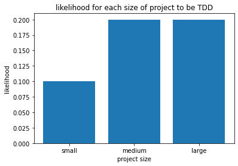

# SDP_CW2

* Research Questions:
 1. Inspect likelihood for a project to be TDD over all projects?
 2. Inspect likelihood for each size of project to be TDD?
 3. Inspect popularity for TDD vs non-TDD projects over all repos
 4. Inspect popularity for TDD vs non-TDD projects for each sized project.
 5. How TDD impacts the commit size and the number of bug-fixing commits?
 6. How can you link a test class (file) to a tested class (file)?


description about RQ1-5:

Before doing the analysis, we need to de identify which repositories are TDD. The TDD probability are calculated and stored in `Repository_info.csv`. And then we will set a benchmark, if the TDD probability >= benchmark, then we think it's a TDD repository.
For example, if the `benchmark = 0.7`, that means we allow 30% of the source code file are committed before their tested file. We can choose one benchmark, or choose several benchmark and make some comparisons. Which one do you think would be better?

1. Inspect likelihood for a project to be TDD over all projects?

 use a for loop to check which repositories are TDD. And then calculate the likelihood.
 
 After calculation, the number of TDD repositories is 5 and they are  ['curator' 'incubator-heron' 'zeppelin' 'incubator-doris' 'nifi']
 
 the likelihood for a project to be TDD over all repositories is 0.16666666666666666

2. Inspect likelihood for each size of project to be TDD?

 Use a for loop to calculate the number of TDD repositories for each size of project and calculate the likelihood. And then, draw a histogram for the likelihood. The xlabel is project size and the ylabel is likelihood.

the likelihood for small project to be TDD is 0.1

the likelihood for medium project to be TDD is 0.2

the likelihood for large project to be TDD is 0.2



3. Inspect popularity for TDD vs non-TDD projects over all repos

 Draw a scatter diagram to show the relationship between stars and TDD probability.
 ```python
 plt.scatter(x1, y1, label="TDD repository")
 plt.scatter(x2, y2, label="non-TDD repository")
 plt.legend()
 plt.xlabel("number of stars")
 plt.ylabel("TDD probability")
 plt.title("the relationship between stars and TDD probability")
 plt.show()

 ```

4. Inspect popularity for TDD vs non-TDD projects for each sized project.

 Similar to RQ3, and we will draw scatter diagram for each size of projects.

5. How TDD impacts the commit size and the number of bug-fixing commits?
 
 - How TDD impacts the commit size
 Use a for loop to calculate the average modified lines in each commit (`Modified Lines / Commits Numbers`). And then, draw two histograms for TDD and non-TDD repositories separately.
 - How TDD impacts the number of bug-fixing commits
 Use a for loop to calculate the persentage of bug-fixing commits in a repository (`Bug Fixing Commits Number / Commits Numbers`). And then, draw two histograms for TDD and non-TDD repositories separately.


